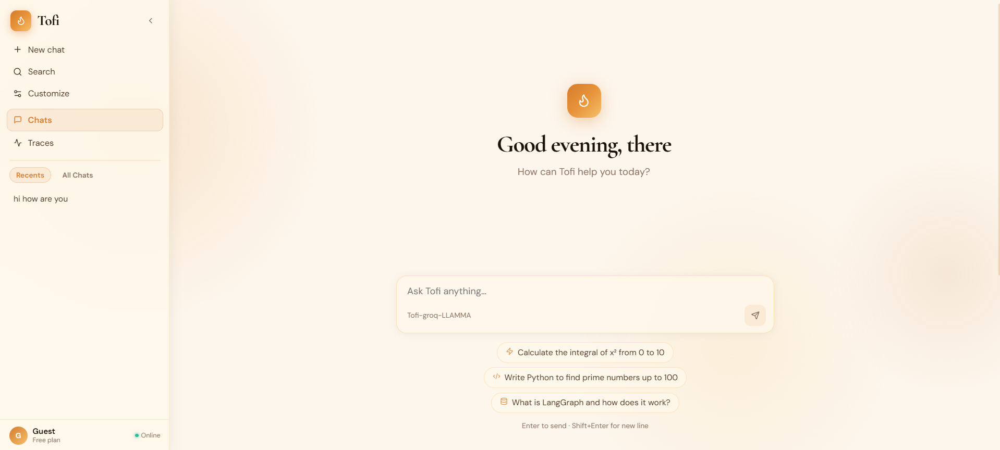
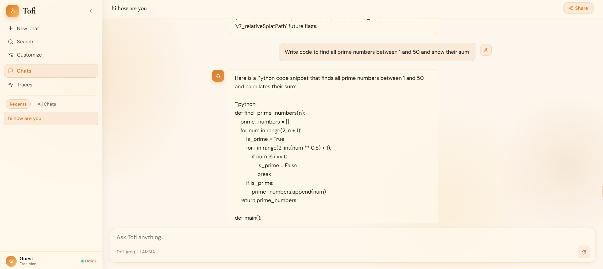
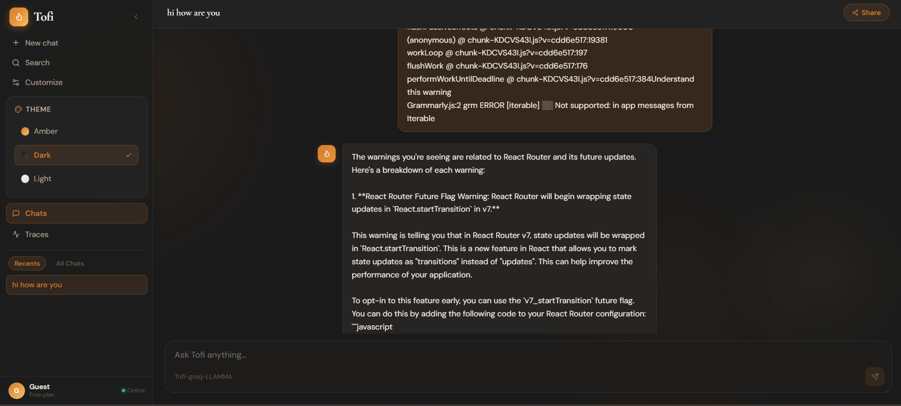
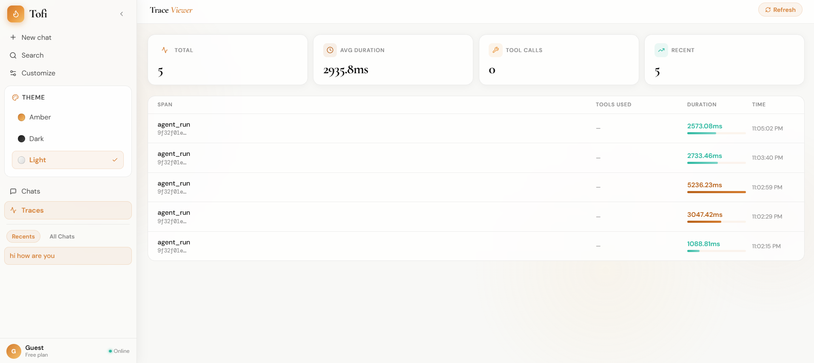

# AI Agent Platform

A full-stack AI Agent platform with LangGraph-powered tool execution, real-time observability, and a sleek terminal-aesthetic UI.

**Stack:** FastAPI · LangGraph · Groq (LLaMA3-70B) · SQLite · React + Vite · OpenTelemetry · Docker · Render

---
## 🌐 Live Demo

🔗 Frontend (Vercel):
https://tofi-aiagent.vercel.app/


🔗 Backend (Render):\
https://tofi-kp32.onrender.com


------------------------------------------------------------------------

## 🖼 Preview






------------------------------------------------------------------------

## Features

- **AI Agent** with 5 built-in tools: Calculator, Python Code Executor, DateTime, Knowledge Base, JSON Schema Generator
- **Tool Call Visualization** – see exactly which tools the agent used and what inputs/outputs were
- **Trace Viewer** – observability dashboard showing latency, tool usage stats, and per-request spans
- **Conversation History** – persisted in SQLite, loaded into sidebar
- **CI/CD** via GitHub Actions → auto-deploy to Render on push to `main`

---

## Project Structure

```
ai-agent-platform/
├── backend/
│   ├── app/
│   │   ├── main.py              # FastAPI app entry
│   │   ├── core/
│   │   │   ├── config.py        # Settings / env vars
│   │   │   └── database.py      # SQLAlchemy async models + session
│   │   ├── agents/
│   │   │   └── agent.py         # LangGraph agent definition
│   │   ├── tools/
│   │   │   └── tools.py         # All agent tools
│   │   ├── api/
│   │   │   ├── chat.py          # Chat + conversations endpoints
│   │   │   ├── traces.py        # Traces + stats endpoints
│   │   │   └── health.py        # Health check
│   │   └── telemetry/
│   │       └── setup.py         # OpenTelemetry setup
│   ├── tests/
│   │   └── test_api.py
│   ├── requirements.txt
│   ├── Dockerfile
│   └── .env.example
├── frontend/
│   ├── src/
│   │   ├── App.jsx
│   │   ├── main.jsx
│   │   ├── index.css
│   │   ├── api/client.js        # Axios instance
│   │   ├── store/chatStore.js   # Zustand state
│   │   ├── components/
│   │   │   ├── Layout.jsx       # Sidebar + nav
│   │   │   ├── MessageBubble.jsx
│   │   │   └── ToolCallViewer.jsx
│   │   └── pages/
│   │       ├── ChatPage.jsx
│   │       └── TracesPage.jsx
│   ├── Dockerfile
│   ├── nginx.conf
│   ├── vite.config.js
│   └── package.json
├── .github/workflows/ci.yml
├── docker-compose.yml
└── .gitignore
```

---

## Prerequisites

- Python 3.12+
- Node.js 20+
- Docker + Docker Compose (optional, for containerized dev)
- A free [Groq API key](https://console.groq.com)

---

## Local Setup (Manual)

### 1. Clone & enter project

```bash
git clone https://github.com/YOUR_USERNAME/ai-agent-platform.git
cd ai-agent-platform
```

### 2. Backend setup

```bash
cd backend

# Create virtual environment
python -m venv venv
source venv/bin/activate        # Windows: venv\Scripts\activate

# Install dependencies
pip install -r requirements.txt

# Create .env file
cp .env.example .env
# Open .env and set your GROQ_API_KEY
```

Edit `backend/.env`:
```
GROQ_API_KEY=gsk_xxxxxxxxxxxxxxxxxxxx
DATABASE_URL=sqlite+aiosqlite:///./agent_platform.db
GROQ_MODEL=llama3-70b-8192
APP_ENV=development
```

```bash
# Run the backend
uvicorn app.main:app --host 0.0.0.0 --port 8000 --reload
```

Backend runs at: http://localhost:8000
API docs at: http://localhost:8000/docs

### 3. Frontend setup (new terminal)

```bash
cd frontend
npm install
npm run dev
```

Frontend runs at: http://localhost:5173

---

## Local Setup (Docker Compose)

```bash
# From project root
cp backend/.env.example backend/.env
# Edit backend/.env and add your GROQ_API_KEY

docker compose up --build
```

- Frontend: http://localhost:5173
- Backend: http://localhost:8000

---

## Running Tests

```bash
cd backend
source venv/bin/activate
pip install pytest pytest-asyncio httpx
pytest tests/ -v
```

---

## Deploy to Render

### Step 1: Push to GitHub

```bash
git init
git add .
git commit -m "Initial commit: AI Agent Platform"
git remote add origin https://github.com/YOUR_USERNAME/ai-agent-platform.git
git push -u origin main
```

### Step 2: Deploy Backend (Web Service)

1. Go to [render.com](https://render.com) → **New** → **Web Service**
2. Connect your GitHub repo
3. Configure:
   - **Name:** `ai-agent-backend`
   - **Root Directory:** `backend`
   - **Runtime:** Python 3
   - **Build Command:** `pip install -r requirements.txt`
   - **Start Command:** `uvicorn app.main:app --host 0.0.0.0 --port $PORT`
4. Add **Environment Variables**:
   - `GROQ_API_KEY` → your Groq key
   - `DATABASE_URL` → `sqlite+aiosqlite:///./agent_platform.db`
   - `GROQ_MODEL` → `llama3-70b-8192`
   - `APP_ENV` → `production`
5. Click **Create Web Service**
6. Copy the URL (e.g. `https://ai-agent-backend.onrender.com`)

### Step 3: Deploy Frontend (Static Site)

1. Go to Render → **New** → **Static Site**
2. Connect same GitHub repo
3. Configure:
   - **Name:** `ai-agent-frontend`
   - **Root Directory:** `frontend`
   - **Build Command:** `npm install && npm run build`
   - **Publish Directory:** `dist`
4. Add **Environment Variables**:
   - `VITE_API_URL` → `https://ai-agent-backend.onrender.com` (your backend URL from Step 2)
5. Click **Create Static Site**

### Step 4: Set GitHub Secret for CI

1. Go to your GitHub repo → **Settings** → **Secrets and variables** → **Actions**
2. Add secret:
   - `GROQ_API_KEY` → your Groq API key
   - `RENDER_BACKEND_URL` → your Render backend URL

### Step 5: Verify Deploy

- Frontend URL: `https://ai-agent-frontend.onrender.com`
- Backend health: `https://ai-agent-backend.onrender.com/api/health`
- API docs: `https://ai-agent-backend.onrender.com/docs`

---

## CI/CD Flow

```
Push to main
     ↓
GitHub Actions
  ├── Backend tests (pytest)
  └── Frontend build (vite build)
     ↓
Render auto-deploys both services from main branch
```

---

## API Endpoints

| Method | Path | Description |
|--------|------|-------------|
| GET | `/api/health` | Health check |
| POST | `/api/chat/` | Send message to agent |
| GET | `/api/chat/conversations` | List all conversations |
| GET | `/api/chat/conversations/{id}/messages` | Get messages for a conversation |
| GET | `/api/traces/` | Get all traces |
| GET | `/api/traces/stats` | Get aggregated stats |

---

## Agent Tools

| Tool | Description |
|------|-------------|
| `calculator` | Evaluate math expressions using Python's math module |
| `execute_python_code` | Run Python snippets in a sandboxed subprocess |
| `get_current_datetime` | Return the current UTC datetime |
| `search_knowledge_base` | Look up info about tech topics (Python, Docker, etc.) |
| `generate_json_schema` | Generate a JSON schema from a plain English description |

---

## Extending the Project

**Add a new tool:**
1. Add a function with `@tool` decorator in `backend/app/tools/tools.py`
2. Add it to `ALL_TOOLS` list
3. Restart the backend — LangGraph picks it up automatically

**Switch LLM model:**
Update `GROQ_MODEL` env var. Available models: `llama3-70b-8192`, `llama3-8b-8192`, `mixtral-8x7b-32768`

**Add PostgreSQL (production upgrade):**
1. Create a Render PostgreSQL instance
2. Update `DATABASE_URL` to `postgresql+asyncpg://...`
3. Add `asyncpg` to requirements.txt
